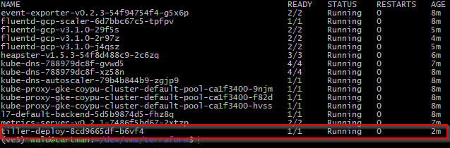
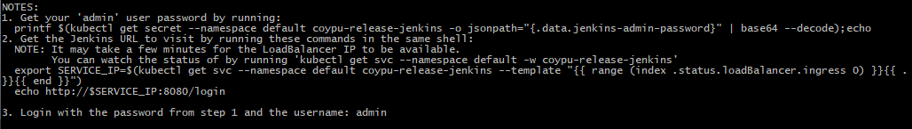
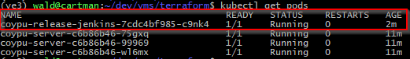
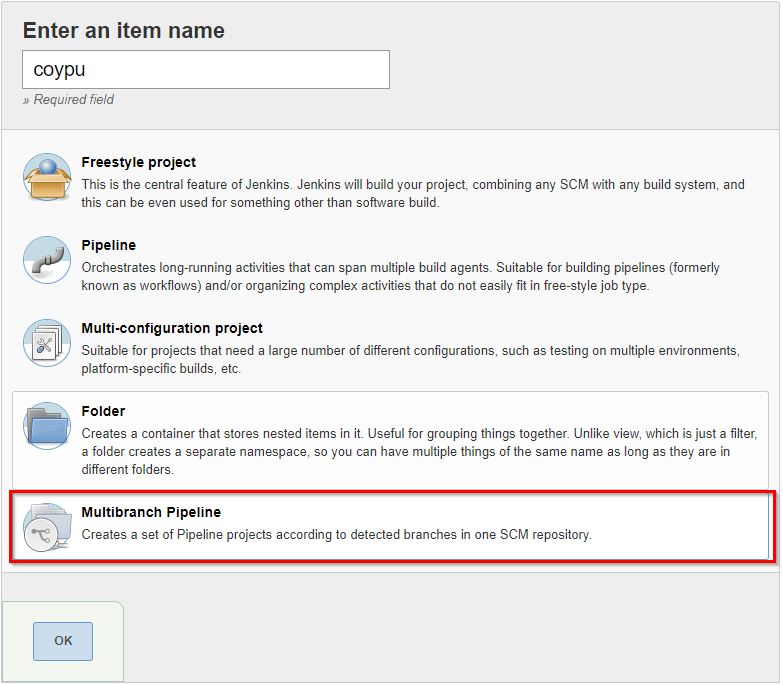
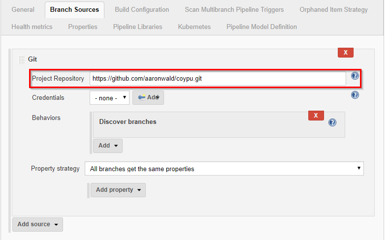
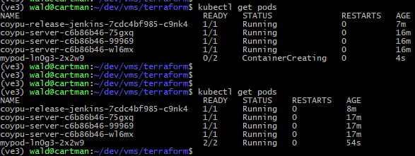

# Introduction

The environment below will use [kubernetes](https://kubernetes.io/) in [GCP](https://cloud.google.com/) to deploy a custom app [coypu](https://github.com/aaronwald/coypu). The initial deployment is done with [terraform](https://www.hashicorp.com/products/terraform). Ubuntu 18.04 bionic build. See [Ansible Playbooks](../playbooks/ubuntu.yml) for packages installed on Ubuntu.

[Helm](https://helm.sh/) is then used to deploy [Jenkins](https://jenkins.io/) into the existing GCP cluster. The jenkins steps then show how to deploy slaves into k8s pods and optionally pull docker images from the Google container registry.

# Setup Google SDK

Install [Google SDK](https://cloud.google.com/sdk/install). Use a versioned archived to include docker support (not supported via apt).

```sh
gcloud init
gcloud components install docker-credential-gcr
```

# Deploy to GKE with terraform

See [Google Kubernetes Engine - GKE](https://cloud.google.com/kubernetes-engine/) reference document.

Create ```file.json``` at _APIs & Services->Credentials->Create credentials->API Key_

See [example terraform file](main.tf) for simple deployment that sets up a cluster, firewall, network, service, and deployment. The reference example also sets up a separate deployment for a customd docker image. This can be edited out.

```sh
export GOOGLE_CLOUD_KEYFILE_JSON=<file.json>
terraform init 
terraform apply
```
 
Setup creds for docker

```sh
docker-credential-gcr configure-docker
```

Setup credentials for kubectl from gcloud

```
gcloud container clusters get-credentials coypu-cluster --zone us-east1-b
```

Verify k8s is pointing to GCP instance.

```sh
kubectl config view
```

# Install Helm on Ubuntu

See document on [RBAC](https://github.com/helm/helm/blob/master/docs/rbac.md).

```sh
sudo snap install helm --classic
kubectl create -f tiller.yaml
helm init --canary-image --service-account tiller --upgrade
```

Example ```tiller.yaml```
```yaml
apiVersion: v1
kind: ServiceAccount
metadata:
  name: tiller
  namespace: kube-system
---
apiVersion: rbac.authorization.k8s.io/v1
kind: ClusterRoleBinding
metadata:
  name: tiller
roleRef:
  apiGroup: rbac.authorization.k8s.io
  kind: ClusterRole
  name: cluster-admin
subjects:
  - kind: ServiceAccount
    name: tiller
    namespace: kube-system
```

## Check Helm Status

```sh
kubectl get pods --namespace kube-system
```



## Helm Cleanup
```sh
kubectl delete deployment tiller-deploy --namespace kube-system
```

# Install Jenkins with Helm

See [section](https://github.com/helm/charts/tree/master/stable/jenkins#rbac) on Jenkins RBAC requirements to created ```jenkins.yaml```.

```sh
helm install stable/jenkins --set rbac.install=true --name coypu-release -f values.yaml
```

Make note of the password and URL from ```heml install```. To recover you can run ```helm status coypu-release```.



Wait for the jenkins pod to start.



## Jenkinsfile

Example [declarative](https://jenkins.io/doc/book/pipeline/syntax/) ```Jenkinsfile``` which will create a pod with a custom docker image. 

```groovy
pipeline {
    agent {
        kubernetes {
            label 'mypod'
            defaultContainer 'jnlp'
            yamlFile 'pod.yaml'
        }
    }
    stages {
        stage('Checkout') {
            steps {
                container('coypullvm') {
                    sh 'mkdir -p build'
                    sh '''
                  export LD_LIBRARY_PATH=/usr/local/lib/ &&
                  mkdir libs &&
                  cd libs &&
                  git clone https://github.com/Tencent/rapidjson.git &&
                  cd .. &&
                  cd build &&
                  cmake -D CMAKE_BUILD_TYPE=Debug -D BUILD_TESTING=ON .. &&
                  make coyputest &&
                  ./coyputest --gtest_output="xml:testresults.xml"
                '''
                }
            }
        }
        stage ('test') {
            steps {
                container('coypullvm') {
                    junit 'build/testresults.xml'
                }
            }
        }
    }
}

```

Container definition is found in ```pod.yaml```.


```yaml
apiVersion: v1
kind: Pod
metadata:
  labels:
    some-label: some-label-value
spec:
  containers:
  - name: coypullvm
    image: gcr.io/some_project_name/coypu_llvm:latest
    command:
    - cat
    tty: true
    image_pull_secrets:
      -name: docker-registry

```

## Add a new project



## Setup your project source



## Jenkins job in k8s

Check that the job is running in k8s.



# Teardown Environment

```
terraform destroy
```
